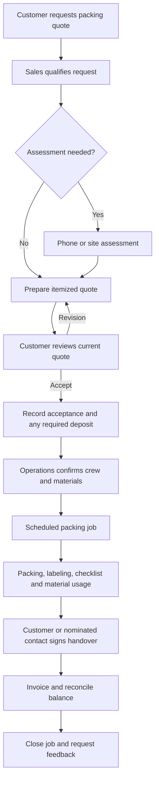

# Project specification

Version: 1.0 — 11 September 2026. This document describes the proposed product; features below are requirements, not implemented functionality.

## 1. What type of business is this?

**A packing services business with a customer booking portal, operations system, and website CMS.** It can pack goods for people who are moving and work as a subcontractor to moving companies, but does not itself operate a moving service.

Suggested positioning: **“Professional packing for homes, offices, and businesses. We protect and prepare your belongings for your chosen transporter.”**

Proposed services:

- Household packing: room-by-room packing, labeling, and item checklists.
- Office packing: documents, equipment, and furniture protection.
- Fragile-item packing: glassware, artwork, electronics, and delicate items.
- Commercial packing: shop stock and business equipment.
- Custom protective packing or crating, only if the business actually provides it.
- Packing materials: boxes, tape, wrap, cushioning, and protective covers.
- Optional unpacking, subject to a separate service definition.

The owner must confirm this service catalog before publication. Do not claim certifications, insurance, national coverage, export compliance, or specialist capabilities without evidence.

Transport, truck booking, freight tracking, driver dispatch, moving-distance pricing, and storage rental are outside the baseline. A customer's nominated transporter can be recorded as a handover contact without representing it as this company's service. Crew travel to the packing site may be a disclosed charge; this is separate from transporting goods.

## 2. Product boundaries and assumptions

| Decision | Proposed baseline |
|---|---|
| Operating model | One company, initially one operating location |
| Customers | Individuals and businesses; partner movers use business customer accounts |
| Selling process | Request → assessment → quote → acceptance → scheduled packing |
| Pricing | Staff-approved quotations; no binding automatic price calculation at launch |
| Booking | A requested date is a preference until operations confirms capacity |
| Materials | Catalog, inquiry, and internal inventory; online retail checkout is a later extension |
| Payments | Record and reconcile bank/cash payments; online gateway is a separate integration |
| Currency | NPR as a configurable initial currency; one currency per quote/invoice |
| Language | English first; translation-ready content; Nepali when translated copy is supplied |
| Time | Store timestamps in UTC; display schedules in Asia/Kathmandu |
| Accounts | Guest inquiry; verified customer account for private quotes, bookings, and documents |

These defaults permit implementation planning. They do not establish legal terms or tax treatment.

## 3. Website and customer experience

| Page or feature | Required content and behavior | Backend owner |
|---|---|---|
| Home | Clear packing-only identity, services, process, service areas, quote CTA | CMS |
| About | Actual company details, team, experience | CMS |
| Services index/detail | Scope, inclusions, exclusions, photos, quote CTA | Services + CMS |
| Materials catalog | Images, sizes, units, availability wording, inquiry CTA | Catalog |
| How it works | Assessment, quotation, scheduling, packing, handover | CMS |
| Service areas | Supported locations and restrictions | Operations + CMS |
| Gallery | Approved photos with captions and consent | Media + CMS |
| FAQs | Packing preparation, materials, scheduling, exclusions | CMS |
| Contact | Phone, email, address, hours, inquiry form | Settings + inquiries |
| Request a quote | Validated multi-step form and reference number | Sales |
| Terms/privacy/cancellation | Owner-approved policy copy | Assigned legal-page publisher |
| Customer account | Profile, inquiries, quotes, bookings, invoices, messages | Customer-owned records |

Quote form fields: contact name, verified contact method, customer type, service, packing-site address and service area, preferred date/time window, approximate items/rooms, access restrictions, fragile items, optional photos, notes, privacy acknowledgment. Do not require pickup/drop-off destinations or truck size. Explain that final price and availability require confirmation.

Form behavior: save validated data, reject unsupported uploads, rate-limit spam, prevent duplicate submissions, show a stable reference, and queue confirmation messages. Inquiry creation must succeed even if email delivery temporarily fails. Provide field-level errors and loading states, keyboard navigation, visible labels, and mobile layouts.

The customer dashboard shows only that customer's records. Guests receive acknowledgment but no unauthenticated access to private records through a guessable reference number. Account linking requires verified contact ownership.

## 4. Complete business process

### Inquiry and assessment

Sales assigns an owner, checks service area and scope, contacts the customer, and records the assessment. Store room/item estimates, required materials, effort, access constraints, and special handling. Unsupported work is declined with a reason. Record follow-up dates and communication history.

### Quotation

Each revision contains line items for labor, materials, optional services, disclosed crew travel, discounts, and applicable tax configuration. Store quantities, units, rates, totals, validity date, inclusions, exclusions, proposed schedule, payment terms, and cancellation terms. Snapshot this information so later catalog changes cannot change a sent quote.

Only an authorized sales approver can send or approve quotes; configurable discount thresholds require manager approval. Customers can accept the current unexpired revision or request a revision. Store accepted revision, timestamp, actor, and terms version. Staff recording telephone acceptance must record evidence and identify that method.

### Booking and scheduling

Accepting a quote creates at most one booking. Deposit requirements are configurable and must be explicit in the quote. Operations checks overlapping crew assignments, duration, and stock before confirming. Reserve materials at confirmation. Changes to the agreed price or scope require a change order accepted by the customer before the extra work begins.

### Packing and handover

The assigned team sees its schedule, site contact, instructions, and checklist. Team members start work, record packed-item counts, label references, actual materials, approved evidence photos, and incidents. Completion requires checklist completion and customer/contact acknowledgment, or a documented exception approved by operations. Handover refers to packed goods at the agreed location, not transport delivery.

### Billing, cancellation, and support

Issue the invoice using agreed charges and accepted changes. Finance reconciles payments and outstanding balances. Cancellation records reason, applicable charges, refund decision, released stock, and released schedule. Refunds and issued invoices have an audit trail rather than silent edits. Support records damage complaints and resolution without automatically admitting or denying liability.

## 5. Status rules

| Record | Status transitions | Controls |
|---|---|---|
| Inquiry | new → contacted → assessing → quoted → converted; or closed/lost | Owner and close reason required |
| Quote revision | draft → approved → sent → accepted / declined / expired / superseded | Acceptance only for latest valid sent revision |
| Booking | pending → confirmed → scheduled → in_progress → completed → closed; cancellation from eligible states | Capacity and deposit policy gate confirmation; finance gates closure |
| Invoice | draft → issued → partially_paid → paid; void or credit workflow when applicable | Issued values immutable; derive balance from ledger |
| Payment | pending → verified / failed; verified → partially_refunded / refunded | Reconciliation and refund permissions separate |
| CMS revision | draft → in_review → approved → published → archived | Separate edit and publish capabilities |

Persist transitions through application actions, with actor, old/new state, timestamp, and reason. Reject illegal transitions server-side. Completion and payment are separate: a job may be physically complete while still owing money.

## 6. Filament backend modules

| Group | Screens and controls |
|---|---|
| Dashboard | New inquiries, follow-ups, today's jobs, outstanding invoices, low stock; permission-filtered widgets |
| Sales | Customers, inquiries, assessments, quote revisions, approvals, communication history |
| Operations | Bookings, calendar, team assignments, checklists, incidents, completion evidence |
| Catalog | Services, materials, units, price references, service areas |
| Inventory | Receipts, reservations, job consumption, returns, adjustments, low-stock alerts |
| Finance | Invoices, payment verification, refunds, balances, permitted exports |
| Website | Pages, sections, navigation, footer, FAQs, galleries, testimonials, SEO, redirects |
| People and access | Staff invitations, account suspension, roles, permissions, individual page assignments |
| Settings | Company contact details, hours, branding, notification templates, business policies |
| Audit and reports | Access changes, publishing history, business transitions, permitted reports |

“Full backend control” means control of defined content and business functions. Executable code, database credentials, application keys, and arbitrary JavaScript are deployment concerns, not editable CMS fields.

CMS sections use a whitelist of supported blocks: hero, rich text, image/text, service grid, benefits, process, testimonials, FAQs, gallery, and call to action. Allow reorder, enable/disable, preview, revision history, scheduling, and rollback. Website managers can adjust approved branding tokens; layouts remain responsive components maintained in code.

SEO controls: title, description, canonical URL rules, social image, index/noindex, sitemap inclusion, and redirect creation after slug changes. Keep draft and private account pages out of public search and sitemaps.

## 7. Requirements the owner must supply

| Input | Why it is needed | Needed before |
|---|---|---|
| Actual service list and exclusions | Accurate customer promise | Content and quote templates |
| Company name, logo, contact details, approved photos | Branding and credibility | Public launch |
| Operating locations, hours, travel boundaries | Inquiry qualification and scheduling | Booking implementation |
| Labor/material rates, units, discount rules | Quotations and inventory | Sales testing |
| Team capacity, durations, assignment rules | Scheduling | Operations testing |
| Deposit, cancellation, refund, damage and handover policies | Workflow and customer terms | Acceptance testing |
| Invoice requirements and approved tax treatment | Finance configuration | Billing launch |
| Staff list and access responsibilities | Permission assignments | Staff onboarding |
| Domain, hosting, database, storage, mail account | Production operation | Deployment |
| Privacy copy, photo consent, retention period | Data handling configuration | Public launch |
| Optional gateway credentials and provider selection | Online payment extension | Gateway development |
| Business acceptance tester | Confirms actual business process | End-to-end review |

Do not store live credentials in this documentation or Git. Tax and policy details need owner/professional confirmation; no tax rate is assumed here.

## 8. Delivery scope

The complete baseline release includes the public website, scoped CMS, staff access control, guest inquiries, customer accounts, quotes, booking and team scheduling, inventory movements, invoices, manual payment reconciliation, email notifications, audit logs, and operational reporting.

Later options: online materials checkout, delivery fulfillment, payment gateways, SMS, Nepali content, partner pricing, multiple branches, barcode labels, accounting synchronization, and advanced analytics. These require separate requirements and testing; they are not prerequisites for the baseline release.

## 9. Business acceptance criteria

- A visitor understands that the business provides packing and submits a request on mobile.
- Staff convert that request into a revisioned quote, and the correct customer accepts it.
- Acceptance cannot duplicate bookings, even on repeated clicks or retries.
- Operations schedules work without double-booking staff or over-reserving stock.
- The assigned team completes the checklist and records consumption and handover.
- Finance issues an invoice and records payments; outstanding balances remain accurate.
- A page editor changes only assigned pages and cannot publish without publication access.
- A website manager maintains public content without gaining finance or user-administration rights.
- Customers cannot see another customer's quotes, documents, photos, or bookings.
- Notification failures are visible to staff and can be retried safely.
- The owner completes a staging rehearsal and verifies a backup restore before launch.
